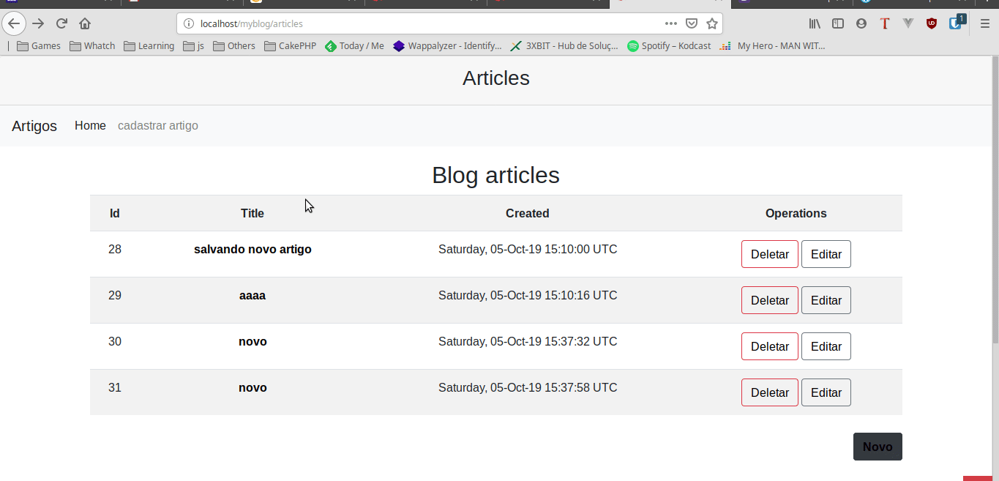

# CakePHP CMS simple example

A skeleton for creating applications with [CakePHP](https://cakephp.org) 3.x.

The framework source code can be found here: [cakephp/cakephp](https://github.com/cakephp/cakephp).

## Installation

1. Download [Composer](https://getcomposer.org/doc/00-intro.md) or update `composer self-update`.
2. Run `php composer.phar create-project --prefer-dist cakephp/app [app_name]`.

If Composer is installed globally, run

```bash
composer create-project --prefer-dist cakephp/app
```

In case you want to use a custom app dir name (e.g. `/myapp/`):

```bash
composer create-project --prefer-dist cakephp/app myapp
```

You can now either use your machine's webserver to view the default home page, or start
up the built-in webserver with:

```bash
bin/cake server -p 8765
```

Then visit `http://localhost:8765` to see the welcome page.

## Project setup

After clone this repository running this following command to install all project dependencies.
```
npm install
```

## Configuration

Read and edit `config/app.php` and setup the `'Datasources'` and any other
configuration relevant for your application.

## Layout
For layout iam using bootstrap 4

## Demonstration 


Get in Touch
===============

I am available facebook **brunojamelli9** , linkedin **bruno-jamelli** and gmail **@brunogeek9**
